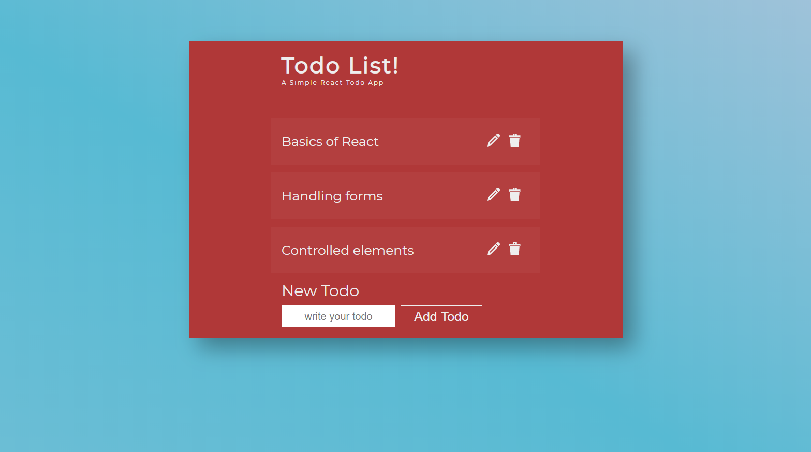

# React To-Do app
**To-Do** is a react application that allows users to create, edit, delete tasks.
## Installation
```bash
    npm install
    npm start
```
## Screenshots

<!-- Images -->


## What I Learned 
* Handling forms in React 
* Applying the concept of controlled elements
* Integrating SASS preprocessor with React for styling
